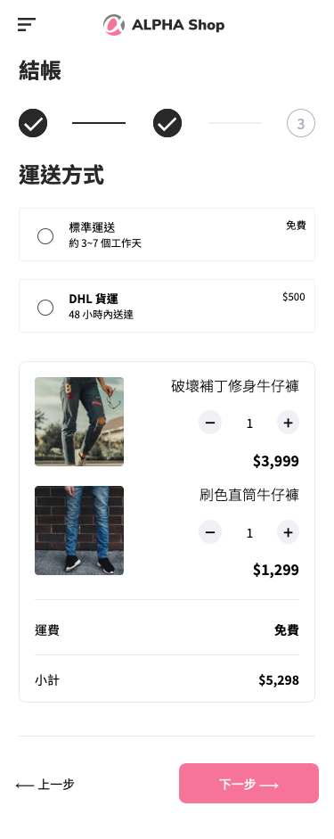
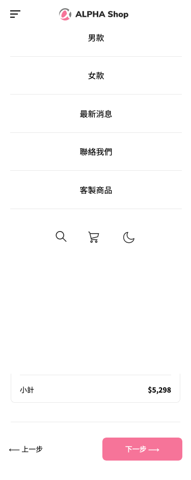
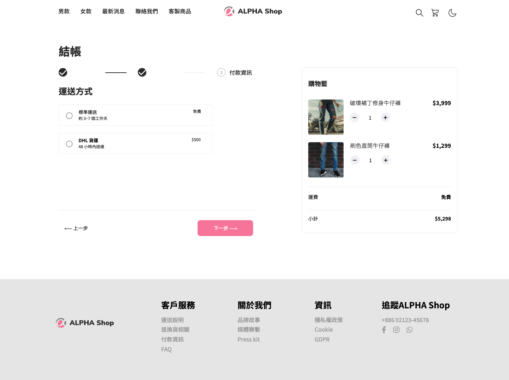

# Alpha Shop

## Overview

### The challenge

Users should be able to:

- View the optimal layout for the site depending on their device's screen size
- Navigate step by step

### Things to be improved

- Fix header for the desktop version (anchor links aren't working but they work on the mobile version)
- Fix navbar as it doe not show 100vh
- Optimise steppers on both mobile and desktop devices
- Add functions for buttons (show previous button & modify order confirmtion button)
- Add functions for Shopping Cart (delivery fee & total amount)
- Add darkmode

### Screenshot

### Built with

- Gulp
- Semantic HTML5 markup
- SASS/SCSS
- Flexbox
- JavaScript
- Mobile-first workflow